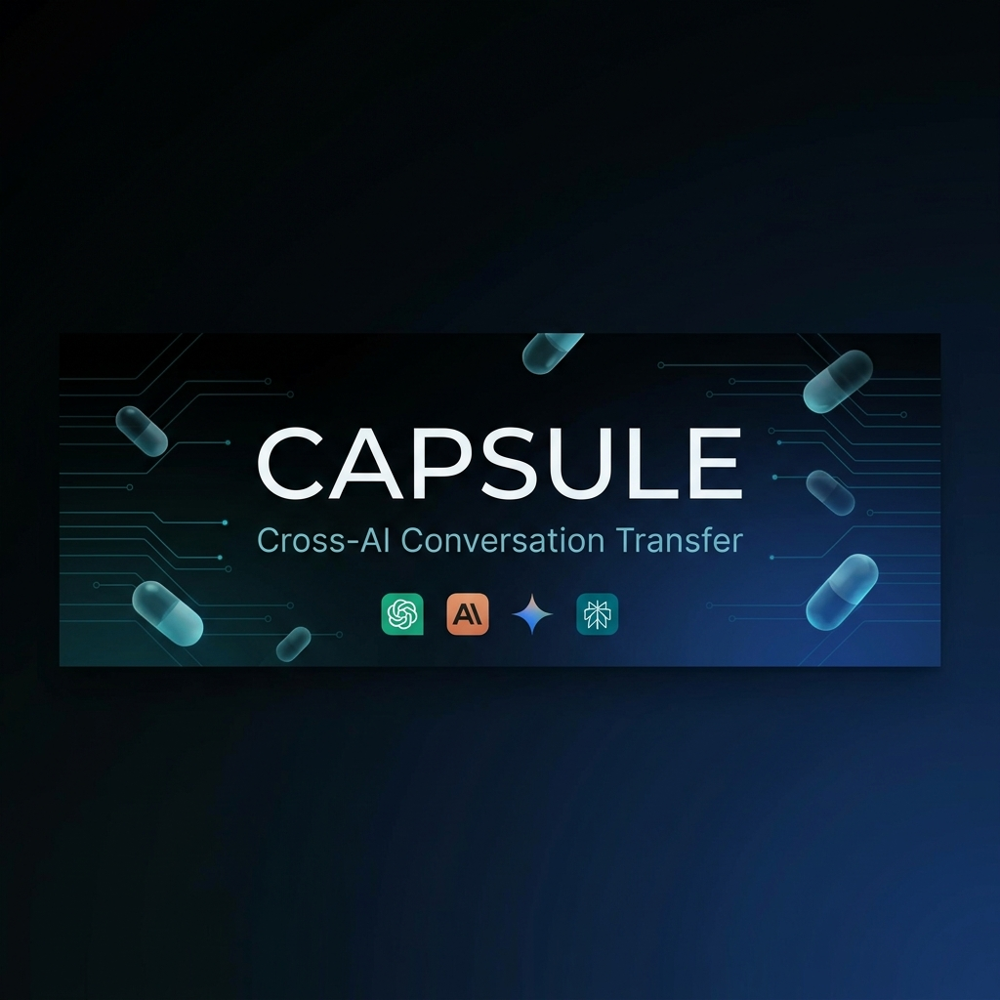
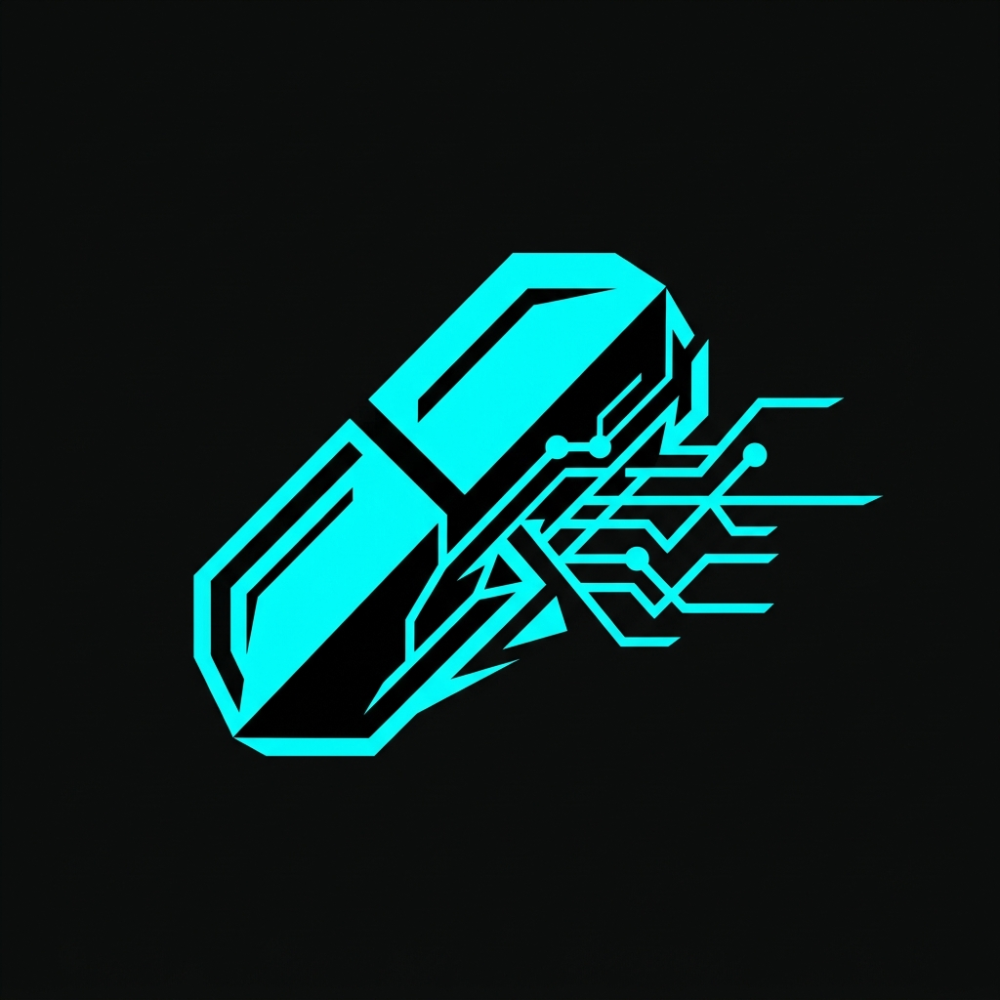

<p align="center">
  
</p>

<p align="center">
  <strong>Capture. Transfer. Inject.</strong><br/>
  <sub>Seamlessly move entire conversations between ChatGPT, Claude, Gemini, and Perplexity — in one click.</sub>
</p>

<p align="center">
  
  
  
  
  
</p>

---

## The Problem

You're deep in a conversation with ChatGPT. You want Claude's opinion. You copy-paste 47 messages, lose all formatting, and waste 10 minutes reformatting. Or you just… don't bother.

**Capsule fixes that.** One click captures the entire conversation. One drag-and-drop injects it into any other AI. Full context preserved.

---

## ✨ Features

| Feature | Description |
|---------|-------------|
| **🔄 One-Click Capture** | Extract a full conversation from any supported AI chat tab |
| **💉 Drag & Drop Injection** | Drop a captured capsule directly into another AI's input field |
| **🔀 Merge & Diff** | Drag one capsule onto another to merge or view differences |
| **🧠 4 AI Platforms** | ChatGPT · Claude · Gemini · Perplexity |
| **🎨 Premium Auth UI** | Sign-in / sign-up with glassmorphism design and smooth animations |
| **⚙️ Settings Panel** | Toggle floating widget visibility, auto-tagging, and more |
| **📋 Context Menus** | Right-click → Capture or Inject without opening the popup |
| **💾 Persistent Storage** | Capsules survive tab closes, browser restarts, and page navigations |
| **🏷️ Auto-Tagging** | Capsules are automatically tagged by source platform |

---

## 🖥️ Screenshots

<p align="center">
  
</p>

> The extension popup features a dark-mode glassmorphism interface with capsule cards, drag handles, preview modals, and a settings panel — all built with custom CSS (no frameworks).

---

## 🏗️ Architecture

```
Capsule/
├── manifest.json              # Chrome MV3 manifest
├── background.js              # Service worker — context menus, message routing
│
├── content/                   # Content scripts (injected into AI sites)
│   ├── index.js               # Entry point — adapter detection, message handling
│   ├── widget.js              # Floating capsule widget (drag & drop)
│   └── adapters/              # Site-specific extraction & injection logic
│       ├── chatgpt.js         #   └─ chatgpt.com
│       ├── claude.js          #   └─ claude.ai
│       ├── gemini.js          #   └─ gemini.google.com
│       └── perplexity.js      #   └─ perplexity.ai
│
├── popup/                     # Extension popup UI
│   ├── popup.html             # Markup — auth, tray, settings, modals
│   ├── popup.css              # Styles — glassmorphism, toggles, animations
│   └── popup.js               # Logic — auth flow, capsule CRUD, drag & drop
│
├── assets/                    # Static assets
│   ├── icon16.png             # Toolbar icon
│   ├── icon48.png             # Extensions page icon
│   ├── icon128.png            # Chrome Web Store icon
│   └── fonts/                 # Bundled fonts (Space Grotesk, JetBrains Mono)
│
└── tests/                     # Playwright E2E test suite
    ├── injection.test.js      # Injection tests for all 4 adapters
    └── persistence.test.js    # Widget state persistence tests
```

---

## 🔧 How It Works

### Capture Flow

```
User clicks "Capture"
    │
    ▼
popup.js ──► chrome.tabs.sendMessage({ action: 'extractChat' })
                │
                ▼
          content/index.js ──► activeAdapter.extractConversation()
                                    │
                                    ▼
                              adapter scans DOM for conversation turns
                              returns [{ role, content }, ...]
                                    │
                                    ▼
                              Saved to chrome.storage.local as capsule
```

### Injection Flow

```
User drags capsule widget onto chat input
    │
    ▼
widget.js ──► activeAdapter.insertIntoInput(formattedText)
                │
                ├─► [contenteditable] → innerHTML + Input events
                ├─► [textarea] → Native value setter + React events
                └─► Fallback → clipboard + user alert
                     │
                     ▼
               Send button enabled via attribute manipulation
```

---

## 📦 Installation

### From Source (Developer Mode)

```bash
# 1. Clone the repository
git clone https://github.com/nayefsiddique-eng/Capsule.git

# 2. Open Chrome extensions page
#    Navigate to chrome://extensions/

# 3. Enable Developer Mode (toggle in top-right)

# 4. Click "Load unpacked" → select the Capsule/ folder

# 5. Pin the Capsule icon in your toolbar
```

### Dependencies (for testing only)

```bash
cd Capsule
npm install
npx playwright install chromium
```

---

## 🧪 Testing

Capsule ships with a Playwright E2E test suite that validates injection logic across all 4 adapters using real DOM fixtures captured from live sites.

```bash
# Run all tests
npx playwright test

# Run with headed browser (visible)
npx playwright test --headed

# Run a specific test file
npx playwright test tests/injection.test.js
```

### Test Matrix

| Adapter | Normal Injection | Fallback (Clipboard) | Status |
|---------|:---:|:---:|:---:|
| ChatGPT | ✅ | ✅ | Passing |
| Claude | ✅ | ✅ | Passing |
| Gemini | ✅ | ✅ | Passing |
| Perplexity | ✅ | ✅ | Passing |
| **Persistence** | ✅ | — | Passing |

> **9 / 9 tests passing** (last run: 35.6s)

---

## 🔌 Writing a New Adapter

Adapters are self-contained modules that teach Capsule how to read and write to a specific AI chat site.

### 1. Create the adapter file

```javascript
// content/adapters/mysite.js

window.capsuleAdapters = window.capsuleAdapters || {};

window.capsuleAdapters.mysite = {
  // Return true if the current page belongs to this adapter
  matches: () => window.location.hostname.includes('mysite.com'),

  // Extract all conversation turns from the DOM
  extractConversation: () => {
    const turns = [];
    document.querySelectorAll('.message').forEach(el => {
      turns.push({
        role: el.classList.contains('user') ? 'user' : 'assistant',
        content: el.textContent.trim()
      });
    });
    return turns;
  },

  // Inject text into the chat input field
  insertIntoInput: async (text) => {
    const input = document.querySelector('textarea');
    if (!input) return false;

    const nativeSetter = Object.getOwnPropertyDescriptor(
      HTMLTextAreaElement.prototype, 'value'
    ).set;
    nativeSetter.call(input, text);
    input.dispatchEvent(new Event('input', { bubbles: true }));

    return true;
  }
};
```

### 2. Register in `manifest.json`

```json
"content_scripts": [{
  "matches": ["https://mysite.com/*"],
  "js": [
    "content/adapters/mysite.js",
    "content/widget.js",
    "content/index.js"
  ]
}]
```

### 3. Add a test fixture

Save a minimal HTML snapshot of the site's conversation DOM as `test-fixtures/mysite.html`, then add the site to the test matrix in `tests/injection.test.js`.

---

## ⚙️ Configuration

| Setting | Storage Key | Default | Description |
|---------|-------------|---------|-------------|
| Show Floating Widget | `showWidget` | `true` | Toggle the in-page capsule widget |
| Enable Auto-Tagging | `enableAutoTagging` | `true` | Auto-tag capsules by source platform |
| Remember Me | `session.persistent` | `true` | Keep session across popup closes |

All settings are persisted in `chrome.storage.local` and take effect immediately.

---

## 🗺️ Roadmap

- [ ] **Export capsules** — Download as Markdown / JSON
- [ ] **Cloud sync** — Sync capsules across devices via backend
- [ ] **More platforms** — Copilot, DeepSeek, Grok, Pi
- [ ] **Keyboard shortcuts** — `Ctrl+Shift+C` to capture, `Ctrl+Shift+V` to inject
- [ ] **Conversation search** — Full-text search across all stored capsules
- [ ] **Team sharing** — Share capsules via link or workspace

---

## 🛡️ Privacy

Capsule runs **entirely locally**. No data is sent to any server. All conversations are stored in `chrome.storage.local` on your machine. The extension requires host permissions only for the 4 supported AI sites to inject content scripts.

---

## 📄 License

ISC © [nayefsiddique-eng](https://github.com/nayefsiddique-eng)

---

<p align="center">
  <sub>Built with ❤️ for people who think across AIs.</sub>
</p>
