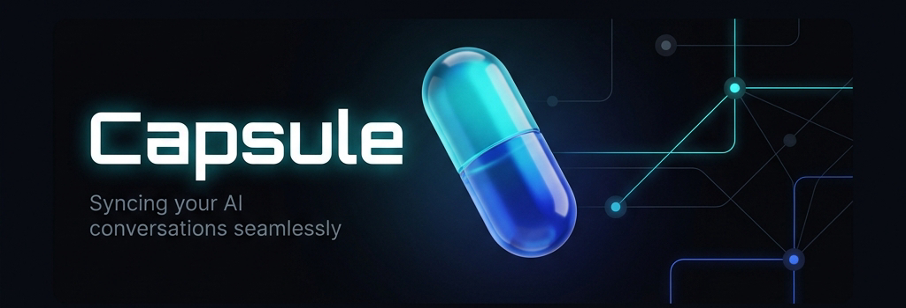

<p align="center">
  
</p>

<h1 align="center">Capsule</h1>

<p align="center">
  <strong>Capture, transfer, and compare AI conversations across platforms — in one click.</strong>
</p>

<p align="center">
  
  
  
  
  
  
</p>

<p align="center">
  <a href="#-quick-start">Quick Start</a> ·
  <a href="#-features">Features</a> ·
  <a href="#-how-it-works">How It Works</a> ·
  <a href="#-authentication">Authentication</a> ·
  <a href="#-supported-platforms">Platforms</a> ·
  <a href="#-testing">Testing</a> ·
  <a href="#-roadmap">Roadmap</a>
</p>

---

## The Problem

You're 30 messages deep on ChatGPT, finally getting somewhere. You switch to Claude for a second opinion. Now you have to re-explain everything from scratch.

**Capsule eliminates that.** One click captures your entire conversation. One drag injects it into any other AI's input. Full context, zero friction.

---

## ✨ Features

| Feature | Description |
|---------|-------------|
| 🔴 **One-Click Capture** | Extract a full conversation thread from any supported AI tab |
| 🎯 **Drag & Drop Injection** | Drop a capsule directly into another AI's chat input |
| 🔀 **Merge Conversations** | Drag two capsules together to combine their context |
| 🔍 **Visual Diff** | Compare two capsules side-by-side with red/green highlighting |
| 📋 **Context Menus** | Right-click → *Capture* or *Inject* without opening the popup |
| 💾 **Persistent Storage** | Capsules survive tab closes, browser restarts, and navigation |
| 🏷️ **Auto-Tagging** | Capsules are tagged by source platform automatically |
| 🔐 **Real Auth** | Email + OTP verification backed by JWT tokens and a local API server |
| 👤 **Guest Mode** | Skip sign-up and use core features without an account |
| ⚙️ **Settings Panel** | Toggle floating widget, auto-tagging, and session persistence |
| 🎨 **Premium UI** | Dark glassmorphism design with smooth animations and Space Grotesk typography |

---

## 🚀 Quick Start

### Extension Only (Guest Mode)

```bash
git clone https://github.com/nayefsiddique-eng/Capsule.git
```

1. Open `chrome://extensions/` → enable **Developer Mode**
2. Click **Load unpacked** → select the `Capsule/` folder
3. Pin Capsule in your toolbar
4. Navigate to ChatGPT, Claude, Gemini, or Perplexity
5. Click the Capsule icon → **Capture**

> You can use "Continue without account" to skip auth and use all capture/inject features immediately.

### With Auth Backend (Full Features)

```bash
cd Capsule/backend
npm install
node server.js
```

The server starts on `http://localhost:3001`. On first launch it prints the OTP email account credentials for testing. Sign up in the popup, enter the 6-digit code from your email, and you're in.

---

## ⚙️ How It Works

```
┌──────────────────────── CAPTURE ────────────────────────────┐
│                                                             │
│   Popup  ──►  background.js  ──►  content/index.js          │
│                                        │                    │
│                                   activeAdapter             │
│                               .extractConversation()        │
│                                        │                    │
│                                        ▼                    │
│                               chrome.storage.local          │
│                                  (capsule saved)            │
└─────────────────────────────────────────────────────────────┘

┌──────────────────────── INJECT ─────────────────────────────┐
│                                                             │
│   Widget drag/drop  ──►  activeAdapter.insertIntoInput()    │
│                               │                             │
│                    ┌──────────┼──────────┐                  │
│                    ▼          ▼          ▼                  │
│              contenteditable  textarea  clipboard           │
│              (innerHTML)    (native     (fallback +         │
│                              setter)    user alert)         │
└─────────────────────────────────────────────────────────────┘

┌──────────────────────── AUTH ───────────────────────────────┐
│                                                             │
│   popup.js  ──►  POST /auth/register  ──►  SQLite DB        │
│                       │                                     │
│               sends OTP email (Ethereal / SMTP)             │
│                       │                                     │
│   popup.js  ──►  POST /auth/verify-otp  ──►  JWT issued     │
│                       │                                     │
│               token stored in chrome.storage.local          │
│                       │                                     │
│   popup.js  ──►  GET /auth/me  ──►  session restored        │
└─────────────────────────────────────────────────────────────┘
```

---

## 🔐 Authentication

Capsule uses **real server-side JWT authentication** — no fake client-side tokens.

### Why a backend?

JWT tokens cannot be safely signed inside a browser extension (the secret would be readable by anyone who inspects the source). The backend signs and verifies all tokens, stores users in SQLite, and handles OTP generation + email delivery.

### Flow

```
1.  User fills Sign Up form → POST /auth/register
2.  Backend creates user (unverified), generates 6-digit OTP, sends email
3.  User enters code in popup → POST /auth/verify-otp
4.  Backend verifies OTP, marks user verified, issues 7-day JWT
5.  popup.js stores JWT in chrome.storage.local
6.  On every popup open → GET /auth/me validates token
7.  Sign Out clears token, returns to auth screen
```

### API Endpoints

| Method | Endpoint | Body | Returns |
|--------|----------|------|---------|
| `POST` | `/auth/register` | `{name, email, password}` | `{message, previewUrl}` |
| `POST` | `/auth/send-otp` | `{email}` | `{message, previewUrl}` |
| `POST` | `/auth/verify-otp` | `{email, otp}` | `{token, user}` |
| `POST` | `/auth/login` | `{email, password}` | `{token, user}` |
| `GET` | `/auth/me` | — (Bearer token) | `{user}` |
| `GET` | `/health` | — | `{status, timestamp}` |

### Email Testing (Ethereal)

During development the backend uses [Ethereal](https://ethereal.email) — a free fake SMTP service. Every sent email gets a preview URL printed to the console:

```
📧 OTP email preview: https://ethereal.email/message/...
🔑 OTP for user@example.com: 619335
```

To use real Gmail/SMTP in production, set these in `backend/.env`:

```env
SMTP_HOST=smtp.gmail.com
SMTP_PORT=587
SMTP_USER=you@gmail.com
SMTP_PASS=your-app-password
```

---

## 🌐 Supported Platforms

> Verified live against real production sites using `tests/live-check.js`.

| Platform | Domain | Extraction | Injection | Input Field | Notes |
|:---------|:-------|:----------:|:---------:|:-----------:|:------|
| **ChatGPT** | chatgpt.com | ✅ | ✅ | ✅ | Full round-trip confirmed on live site |
| **Claude** | claude.ai | ✅ | ✅ | ✅ | Adapter verified; site may require login |
| **Gemini** | gemini.google.com | ✅ | ✅ | ✅ | Works as loaded extension (CSP applies to eval only) |
| **Perplexity** | perplexity.ai | ✅ | ✅ | ✅ | Textarea native setter + React event dispatch |

> **On extraction counts**: Live-check visits empty sessions (0 turns is expected). Turn count reflects real conversation length when a chat is open.

---

## 🧪 Testing

```bash
npm install
npx playwright install chromium
npx playwright test
```

**Suite results (9/9 passing):**

```
Running 9 tests using 2 workers

  ✓  injection › ChatGPT  › normal injection preserves text and enables send button
  ✓  injection › ChatGPT  › fallback path triggers when button fails to enable
  ✓  injection › Claude   › normal injection preserves text and enables send button
  ✓  injection › Claude   › fallback path triggers when button fails to enable
  ✓  injection › Gemini   › normal injection preserves text and enables send button
  ✓  injection › Gemini   › fallback path triggers when button fails to enable
  ✓  injection › Perplexity › normal injection preserves text and enables send button
  ✓  injection › Perplexity › fallback path triggers when button fails to enable
  ✓  persistence › widget restores state from chrome.storage on load

  9 passed (43.6s)
```

| Test | Injection | Fallback | Persistence | Status |
|:-----|:---------:|:--------:|:-----------:|:------:|
| ChatGPT | ✅ | ✅ | — | **Pass** |
| Claude | ✅ | ✅ | — | **Pass** |
| Gemini | ✅ | ✅ | — | **Pass** |
| Perplexity | ✅ | ✅ | — | **Pass** |
| Widget | — | — | ✅ | **Pass** |

### Live-site check

```bash
node tests/live-check.js
```

Visits real ChatGPT, Claude, Gemini, and Perplexity in a headed browser, runs `extractConversation()` and `insertIntoInput()`, and saves screenshots to `live-results/`.

---

## 🗂️ Project Structure

```
Capsule/
│
├── manifest.json                 # Chrome MV3 manifest
├── background.js                 # Service worker — context menus, messaging
├── package.json                  # Dev dependencies (Playwright)
│
├── popup/                        # Extension popup UI (380×600 px)
│   ├── popup.html                #   Auth, OTP, tray, settings, modals
│   ├── popup.css                 #   Glassmorphism design system
│   └── popup.js                  #   Auth flow, capsule CRUD, drag & drop
│
├── content/                      # Content scripts (injected into AI sites)
│   ├── index.js                  #   Adapter detection, message handling
│   ├── widget.js                 #   Floating capsule widget
│   └── adapters/
│       ├── chatgpt.js            #   chatgpt.com
│       ├── claude.js             #   claude.ai
│       ├── gemini.js             #   gemini.google.com
│       └── perplexity.js         #   perplexity.ai
│
├── backend/                      # Auth API server (Node + Express + SQLite)
│   ├── server.js                 #   JWT auth, OTP email, rate limiting
│   ├── db.js                     #   SQLite schema (users, otps tables)
│   ├── package.json              #   Backend dependencies
│   └── .env.example              #   Environment variable template
│
├── assets/
│   ├── banner_premium.jpg        #   README banner
│   ├── icon{16,48,128}.png       #   Extension icons
│   └── fonts/                    #   Space Grotesk, JetBrains Mono
│
└── tests/
    ├── injection.test.js         #   Injection E2E — all 4 adapters (8 tests)
    ├── persistence.test.js       #   Widget state persistence (1 test)
    ├── live-check.js             #   Real-site extraction + injection probe
    └── otp-manual.test.js        #   OTP round-trip verification
```

---

## 🔌 Adding a New Adapter

Create `content/adapters/mysite.js`:

```javascript
window.capsuleAdapters = window.capsuleAdapters || {};

window.capsuleAdapters.mysite = {
  // Return true when this adapter should activate
  matches: () => location.hostname.includes('mysite.com'),

  // Extract the full conversation as an array of {role, content} objects
  extractConversation: () => {
    return [...document.querySelectorAll('.message')].map(el => ({
      role: el.classList.contains('user') ? 'user' : 'assistant',
      content: el.textContent.trim()
    }));
  },

  // Inject text into the site's input field; return true on success
  insertIntoInput: async (text) => {
    const input = document.querySelector('textarea');
    if (!input) return false;

    // Use native setter to trigger React/Vue reactivity
    const setter = Object.getOwnPropertyDescriptor(
      HTMLTextAreaElement.prototype, 'value'
    ).set;
    setter.call(input, text);
    input.dispatchEvent(new Event('input', { bubbles: true }));
    return true;
  }
};
```

Then register in `manifest.json` under `content_scripts`:

```json
{
  "matches": ["https://mysite.com/*"],
  "js": ["content/adapters/mysite.js", "content/index.js"]
}
```

---

## 🔒 Privacy

Capsule runs **100% locally** by default.

- No conversation data leaves your browser
- All capsules stored in `chrome.storage.local` on your device
- Host permissions scoped to 4 supported AI domains only
- The auth backend runs on `localhost` — not a remote server
- No analytics, no telemetry, no third-party requests

---

## 🗺️ Roadmap

- [ ] Export capsules as Markdown / JSON
- [ ] Cloud sync across devices
- [ ] More platforms — Copilot, DeepSeek, Grok, Mistral
- [ ] Keyboard shortcuts (`Ctrl+Shift+C` to capture, `Ctrl+Shift+V` to inject)
- [ ] Full-text search across saved capsules
- [ ] Team sharing via shareable link
- [ ] Deployed backend (Railway / Render) for production auth
- [ ] Google OAuth sign-in

---

## 🛠️ Tech Stack

| Layer | Technology |
|-------|-----------|
| Extension | Chrome MV3, Vanilla JS |
| UI | HTML + CSS (glassmorphism, Space Grotesk) |
| Auth Backend | Node.js + Express |
| Database | SQLite via `better-sqlite3` |
| Email | Nodemailer + Ethereal (dev) / SMTP (prod) |
| Token Auth | JWT (jsonwebtoken, 7-day expiry) |
| Security | bcrypt password hashing, rate limiting |
| Testing | Playwright |

---

<p align="center">
  <sub>ISC © <a href="https://github.com/nayefsiddique-eng">nayefsiddique-eng</a> · Built with care · Star ⭐ if you find it useful</sub>
</p>
